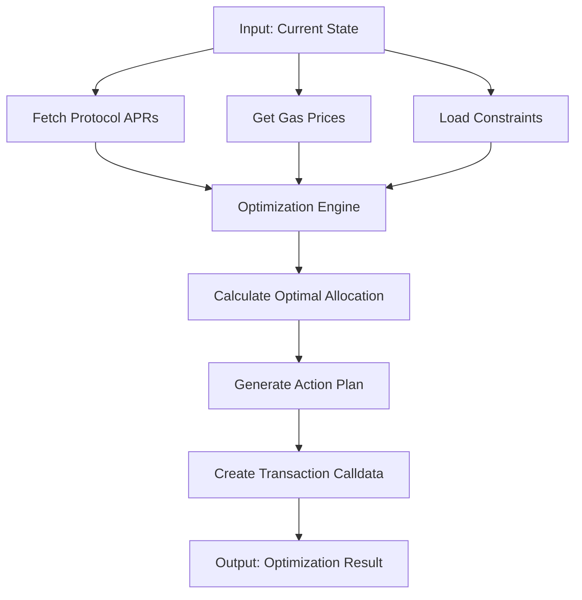

## What is the Optimizer?

The **Giza Optimizer** is a stateless service that calculates optimal capital allocation across DeFi lending protocols. It looks at current APRs, gas costs, and constraints to find the distribution of capital with the highest net return.

## How It Works



## Two Integration Patterns

### 1. Automatic (Agentic)

Agents use the optimizer automatically:

```typescript
// You just activate the agent
await agent.activate({
  owner: userWallet,
  token: USDC_ADDRESS,
  protocols: ['aave', 'compound', 'moonwell'],
  txHash: depositTxHash,
});

// Agent internally calls optimizer, then executes the plan
```

Behind the scenes:
1. Agent calls optimizer with current allocations
2. Optimizer returns optimal allocation + action plan
3. Agent executes the rebalancing transactions
4. Repeat on regular optimization cycles

### 2. Manual (IaaS)

Call the optimizer directly for custom implementations:

```typescript
const result = await giza.optimize({
  token: USDC_ADDRESS,
  capital: "1000000000", // 1000 USDC (6 decimals)
  currentAllocations: {
    aave: "500000000",
    compound: "500000000"
  },
  protocols: ["aave", "compound", "moonwell", "seamless"],
});

console.log('Optimal allocation:', result.optimization_result.allocations);
console.log('Action plan:', result.action_plan);
console.log('Execution calldata:', result.calldata);
```

Use this for:
- Partners with existing execution infrastructure
- Custom rebalancing schedules and strategies
- Integration with your own capital management systems
- Full control over execution while leveraging Giza's optimization intelligence

## Stateless Design

The optimizer is **completely stateless**:

- No storage of historical data
- Each call is independent
- Same inputs always return same outputs (for same market conditions)
- No side effects
- Can be called from anywhere

This stateless design means:
- **Predictable**: Results depend only on inputs
- **Testable**: Easy to unit test scenarios
- **Composable**: Plugs into any system
- **Scalable**: No state to manage
- **Private**: Giza doesn't store your data
- **IaaS-Ready**: Works well as an Intelligence as a Service endpoint

## Optimizer Input

### Required Parameters

<ParamField path="token" type="Address" required>
  Token to optimize (e.g., USDC address)
</ParamField>

<ParamField path="capital" type="string" required>
  Total capital to allocate (bigint as string, in token's smallest unit)

  Example: `"1000000000"` for 1000 USDC (6 decimals)
</ParamField>

<ParamField path="currentAllocations" type="Record<string, string>" required>
  Current distribution across protocols (bigint as string)

  Example:
  ```typescript
  {
    aave: "500000000",
    compound: "300000000",
    moonwell: "200000000"
  }
  ```
</ParamField>

<ParamField path="protocols" type="string[]" required>
  Protocols to consider in optimization

  Example: `["aave", "compound", "moonwell", "seamless"]`
</ParamField>

### Optional Parameters

<ParamField path="constraints" type="ConstraintConfig[]">
  Constraints to respect during optimization. See [Constraints](#constraints) section below for details.

  Example:
  ```typescript
  [
    {
      kind: WalletConstraints.MIN_PROTOCOLS,
      params: { min_protocols: 2 }
    },
    {
      kind: WalletConstraints.MAX_AMOUNT_PER_PROTOCOL,
      params: { protocol: "aave", max_ratio: 0.5 }  // Cap aave at 50%
    }
  ]
  ```
</ParamField>

<ParamField path="wallet_address" type="Address">
  Wallet address that will execute the transactions.
  Example: `"0x1234567890123456789012345678901234567890"`
</ParamField>

## Optimizer Output

### Optimization Result

```typescript
interface OptimizationResult {
  // Optimal allocation for each protocol
  allocations: ProtocolAllocation[];

  // Total gas costs for rebalancing
  total_costs: number;

  // Initial weighted APR (before optimization)
  weighted_apr_initial: number;

  // Final weighted APR (after optimization)
  weighted_apr_final: number;

  // Improvement in APR (percentage points)
  apr_improvement: number;

  // Estimated total gas cost in USD (optional)
  gas_estimate_usd?: number;

  // Number of days until APR improvement exceeds gas cost (optional)
  break_even_days?: number;
}
```

Example:

```typescript
{
  allocations: [
    {
      protocol: "moonwell",
      allocation: "450000000",
      apr: 8.5
    },
    {
      protocol: "aave",
      allocation: "350000000",
      apr: 7.2
    },
    {
      protocol: "compound",
      allocation: "200000000",
      apr: 6.8
    }
  ],
  total_costs: 0.45, // USD
  weighted_apr_initial: 7.1,
  weighted_apr_final: 7.8,
  apr_improvement: 0.7, // +0.7% APR
  gas_estimate_usd: 2.50, // Estimated gas in USD
  break_even_days: 12.5 // Days until APR gain exceeds gas cost
}
```

### Action Plan

Step-by-step instructions to achieve the optimal allocation:

```typescript
interface ActionDetail {
  action_type: 'deposit' | 'withdraw';
  protocol: string;
  amount: string;
  underlying_amount?: string; // For withdrawals
}
```

Example:

```typescript
[
  {
    action_type: "withdraw",
    protocol: "compound",
    amount: "300000000",
    underlying_amount: "301234567" // Amount + accrued interest
  },
  {
    action_type: "deposit",
    protocol: "moonwell",
    amount: "450000000"
  },
  {
    action_type: "deposit",
    protocol: "aave",
    amount: "100000000"
  }
]
```

### Execution Calldata

Ready-to-execute transaction data:

```typescript
interface CalldataInfo {
  contract_address: string;    // Target contract
  function_name: string;        // Function to call
  parameters: string[];         // ABI-encoded parameters
  value: string;                // Native token value (usually "0")
  protocol: string;             // Protocol name
  description: string;          // Human-readable description
}
```

Example:

```typescript
[
  {
    contract_address: "0xCompoundComet...",
    function_name: "withdraw",
    parameters: ["0x833589fCD6eDb6E08f4c7C32D4f71b54bdA02913", "300000000"],
    value: "0",
    protocol: "compound",
    description: "Withdraw 300 USDC from Compound"
  },
  {
    contract_address: "0xMoonwellMarket...",
    function_name: "supply",
    parameters: ["0x833589fCD6eDb6E08f4c7C32D4f71b54bdA02913", "450000000"],
    value: "0",
    protocol: "moonwell",
    description: "Deposit 450 USDC to Moonwell"
  }
]
```

## Optimization Algorithm

### Factors Considered

<AccordionGroup>
  <Accordion title="Protocol APRs">
    Real-time APRs from each protocol for the specific token. Weighted by allocation size.
  </Accordion>

  <Accordion title="Gas Costs">
    Estimated gas for each rebalancing transaction. Optimization only proceeds if APR improvement exceeds gas costs.
  </Accordion>

  <Accordion title="Protocol Liquidity">
    Available liquidity in each protocol. Won't allocate more than what the protocol can efficiently handle.
  </Accordion>

  <Accordion title="Slippage">
    Price impact of large deposits/withdrawals, especially for smaller protocols.
  </Accordion>

  <Accordion title="Constraints">
    User-defined constraints (min protocols, max per protocol, exclusions, etc.).
  </Accordion>

  <Accordion title="Transaction Minimization">
    Prefer fewer, larger transactions over many small ones to save gas.
  </Accordion>
</AccordionGroup>

### Optimization Goals

The optimizer follows a **constraint-based optimization** approach:

1. **Fetch Data**: Get current APRs, gas prices, liquidity
2. **Apply Constraints**: Filter out invalid allocations
3. **Calculate Scores**: Score each possible allocation
4. **Select Optimal**: Choose highest net return allocation
5. **Generate Plan**: Create minimal set of transactions
6. **Validate**: Ensure plan respects all constraints

## Constraints

### Available Constraint Types

```typescript
enum WalletConstraints {
  MIN_PROTOCOLS = 'min_protocols',
  MAX_ALLOCATION_AMOUNT_PER_PROTOCOL = 'max_allocation_amount_per_protocol',
  MAX_AMOUNT_PER_PROTOCOL = 'max_amount_per_protocol',
  MIN_AMOUNT = 'min_amount',
  EXCLUDE_PROTOCOL = 'exclude_protocol',
  MIN_ALLOCATION_AMOUNT_PER_PROTOCOL = 'min_allocation_amount_per_protocol',
}
```

### Constraint Examples

<CodeGroup>

```typescript Min Protocols
{
  kind: WalletConstraints.MIN_PROTOCOLS,
  params: {
    min_protocols: 2,
    min_fraction_per_protocol: 0.1  // Optional, default 0.05 (5%)
  }
}
// Always diversify across at least 2 protocols, each with at least 10%
```

```typescript Max Ratio Per Protocol
{
  kind: WalletConstraints.MAX_AMOUNT_PER_PROTOCOL,
  params: {
    protocol: "aave",
    max_ratio: 0.5  // 50% of total capital
  }
}
// Cap aave at 50% of total capital
// NOTE: Requires both 'protocol' and 'max_ratio' (0-1)
```

```typescript Max Absolute Amount Per Protocol
{
  kind: WalletConstraints.MAX_ALLOCATION_AMOUNT_PER_PROTOCOL,
  params: {
    protocol: "moonwell",
    max_amount: 2000000000  // 2000 USDC (6 decimals)
  }
}
// Cap Moonwell at absolute 2000 USDC regardless of total capital
```

```typescript Exclude Protocol
{
  kind: WalletConstraints.EXCLUDE_PROTOCOL,
  params: { protocol: "compound" }
}
// Never allocate to Compound
```

```typescript Min Amount Per Used Protocol
{
  kind: WalletConstraints.MIN_AMOUNT,
  params: { min_amount: 100000000 }  // 100 USDC
}
// Any protocol that receives allocation must get at least 100 USDC
```

```typescript Min Allocation For Specific Protocol
{
  kind: WalletConstraints.MIN_ALLOCATION_AMOUNT_PER_PROTOCOL,
  params: {
    protocol: "aave",
    min_amount: 500000000  // 500 USDC
  }
}
// Ensure aave gets at least 500 USDC if it's used
```

</CodeGroup>

### Key Differences: MAX_AMOUNT_PER_PROTOCOL vs MAX_ALLOCATION_AMOUNT_PER_PROTOCOL

| Constraint | Parameter | Description |
|------------|-----------|-------------|
| `MAX_AMOUNT_PER_PROTOCOL` | `max_ratio` (0-1) | Limits a protocol to a **percentage** of total capital |
| `MAX_ALLOCATION_AMOUNT_PER_PROTOCOL` | `max_amount` (integer) | Limits a protocol to an **absolute amount** |

Both require the `protocol` parameter to specify which protocol to constrain.

### Combining Constraints

```typescript
await giza.optimize({
  token: USDC_ADDRESS,
  capital: "10000000000", // 10k USDC
  currentAllocations: { aave: "10000000000" },
  protocols: ["aave", "compound", "moonwell", "seamless"],
  constraints: [
    // Diversify across at least 3 protocols
    {
      kind: WalletConstraints.MIN_PROTOCOLS,
      params: { min_protocols: 3 }
    },
    // Cap each protocol at 40% of total (apply to each protocol you want to limit)
    {
      kind: WalletConstraints.MAX_AMOUNT_PER_PROTOCOL,
      params: { protocol: "aave", max_ratio: 0.4 }
    },
    {
      kind: WalletConstraints.MAX_AMOUNT_PER_PROTOCOL,
      params: { protocol: "compound", max_ratio: 0.4 }
    },
    {
      kind: WalletConstraints.MAX_AMOUNT_PER_PROTOCOL,
      params: { protocol: "moonwell", max_ratio: 0.4 }
    },
    {
      kind: WalletConstraints.MAX_AMOUNT_PER_PROTOCOL,
      params: { protocol: "seamless", max_ratio: 0.4 }
    },
    // Additionally cap newer protocol at absolute 2000 USDC
    {
      kind: WalletConstraints.MAX_ALLOCATION_AMOUNT_PER_PROTOCOL,
      params: { protocol: "seamless", max_amount: 2000000000 }
    },
    // Avoid dust allocations - any used protocol must have at least 500 USDC
    {
      kind: WalletConstraints.MIN_AMOUNT,
      params: { min_amount: 500000000 }
    }
  ]
});
```

<Note>
**Important**: `MAX_AMOUNT_PER_PROTOCOL` requires a constraint for **each protocol** you want to limit.
It uses `max_ratio` (0-1), not `max_amount`. For absolute amounts, use `MAX_ALLOCATION_AMOUNT_PER_PROTOCOL`.
</Note>

## Using the Optimizer

### Basic Usage

```typescript
import { Giza, Chain, WalletConstraints } from '@gizatech/agent-sdk';

const giza = new Giza({ chain: Chain.BASE });

const result = await giza.optimize({
  token: "0x833589fCD6eDb6E08f4c7C32D4f71b54bdA02913",
  capital: "1000000000",
  currentAllocations: {
    aave: "600000000",
    compound: "400000000"
  },
  protocols: ["aave", "compound", "moonwell"],
});

console.log(`APR improvement: +${result.optimization_result.apr_improvement}%`);
console.log(`From ${result.optimization_result.weighted_apr_initial}% to ${result.optimization_result.weighted_apr_final}%`);
console.log(`Actions needed: ${result.action_plan.length}`);
console.log(`Gas cost: $${result.optimization_result.total_costs}`);

// Execute the plan (if using IaaS)
for (const calldata of result.calldata) {
  console.log(`Execute: ${calldata.description}`);
  // Send transaction to calldata.contract_address
  // Call calldata.function_name with calldata.parameters
}
```

### Dry Run Scenarios

Test different scenarios without executing:

```typescript
// Scenario 1: Current allocation
const current = await giza.optimize({
  token: USDC_ADDRESS,
  capital: "1000000000",
  currentAllocations: { aave: "1000000000" },
  protocols: ["aave", "compound", "moonwell"],
});

// Scenario 2: Add more protocols
const expanded = await giza.optimize({
  token: USDC_ADDRESS,
  capital: "1000000000",
  currentAllocations: { aave: "1000000000" },
  protocols: ["aave", "compound", "moonwell", "seamless", "fluid"],
});

// Compare
console.log(`Current APR: ${current.optimization_result.weighted_apr_final}%`);
console.log(`With more protocols: ${expanded.optimization_result.weighted_apr_final}%`);
console.log(`Potential gain: +${expanded.optimization_result.weighted_apr_final - current.optimization_result.weighted_apr_final}%`);
```

## Best Practices

<AccordionGroup>
  <Accordion title="Don't over-optimize">
    Calling the optimizer too frequently wastes gas. Let APR differences accumulate before rebalancing.

    **Good:** Every 6-24 hours
    **Bad:** Every 5 minutes
  </Accordion>

  <Accordion title="Set minimum APR improvement threshold">
    Only rebalance if APR improvement exceeds a threshold (e.g., 0.3%).

    ```typescript
    if (result.optimization_result.apr_improvement > 0.3) {
      // Execute rebalancing
    }
    ```
  </Accordion>

  <Accordion title="Use constraints for risk management">
    Always set constraints to match your risk tolerance and diversification requirements.
  </Accordion>

  <Accordion title="Consider gas prices">
    During high gas periods, higher APR improvement may be needed to justify rebalancing.
  </Accordion>
</AccordionGroup>

## Next Steps

<CardGroup cols={2}>
  <Card
    title="IaaS Integration"
    icon="server"
    href="/guides/iaas-integration"
  >
    Build custom strategies with the optimizer
  </Card>
  <Card
    title="API Reference"
    icon="code"
    href="/sdk-reference/optimizer"
  >
    Complete optimizer API documentation
  </Card>
  <Card
    title="Examples"
    icon="lightbulb"
    href="/examples/advanced-patterns"
  >
    Optimization patterns and examples
  </Card>
  <Card
    title="Agentic Integration"
    icon="robot"
    href="/guides/agentic-integration"
  >
    Use agents with automatic optimization
  </Card>
</CardGroup>
