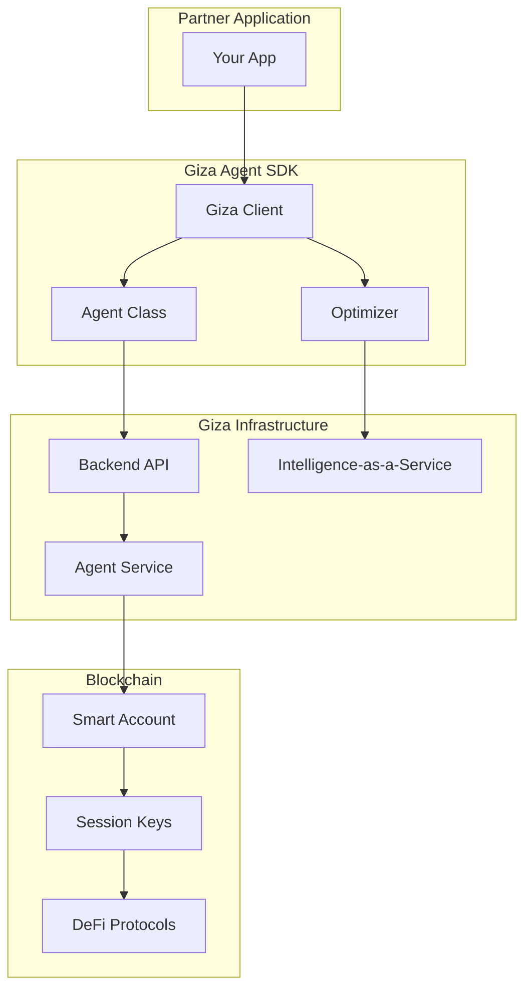
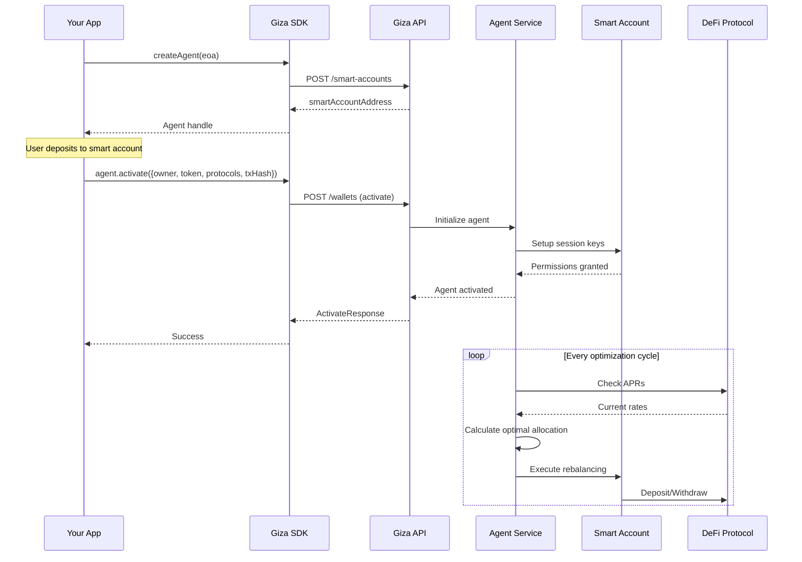

## Introduction

The Giza Agent SDK is built on several key concepts that work together to enable autonomous yield optimization. Understanding these concepts will help you integrate the SDK effectively.

## Architecture Overview

## Key Components

### 1. Smart Accounts

**Smart accounts** are the foundation of Giza agents. Each user gets a deterministic smart account address where they deposit funds for the agent to manage.

<Card title="Learn More" icon="shield-halved" href="/concepts/smart-accounts">
  Deep dive into smart accounts, ZeroDev, and session keys
</Card>

**Key Features:**
- **Account Abstraction**: Powered by ZeroDev, enabling gasless transactions
- **Deterministic**: Same origin wallet always generates the same smart account
- **Self-custody**: User maintains ultimate control through their origin wallet
- **Session Keys**: Enable agents to execute functions without user signatures

### 2. Agents

**Agents** are autonomous yield optimizers that manage capital in smart accounts. Once activated, they continuously monitor APRs and rebalance funds across protocols.

<Card title="Learn More" icon="robot" href="/concepts/agents">
  Understanding agent lifecycle and operations
</Card>

**Agent Lifecycle:**
1. **Inactive**: Smart account exists but agent not activated
2. **Activating**: Agent being initialized (brief)
3. **Active**: Agent running and optimizing
4. **Deactivating**: Withdrawing all funds (brief)
5. **Deactivated**: Agent stopped, funds returned

**Capabilities:**
- Monitor APRs across multiple protocols in real-time
- Execute deposits, withdrawals, and swaps automatically
- Optimize gas costs through transaction batching
- Handle protocol-specific nuances (fees, limits, rewards)

### 3. Protocols

**Protocols** are DeFi lending platforms where agents deploy capital to earn yield. Giza supports major lending protocols including Aave, Compound, Moonwell, Morpho vaults, and more.

<Card title="Learn More" icon="layer-group" href="/concepts/protocols">
  Explore supported protocols by chain
</Card>

**Protocol Selection:**
- Partners can allow agents to use all available protocols
- Or restrict to a subset based on risk preferences
- Agents automatically discover the best opportunities within selected protocols

### 4. Optimizer

The **Optimizer** is a stateless service that calculates optimal capital allocation across protocols. It can be used standalone (IaaS approach) or automatically by agents (Agentic approach).

<Card title="Learn More" icon="chart-mixed" href="/concepts/optimizer">
  Understanding the optimization engine
</Card>

**Features:**
- **Stateless**: No storage, pure computation service
- **Real-time APR Data**: Uses live protocol rates
- **Constraint Support**: Respect min protocols, max per protocol, exclusions
- **Action Plans**: Returns detailed steps to achieve optimal allocation
- **Execution Calldata**: Provides ready-to-execute transaction data

## Data Flow

## Session Keys

**Session keys** enable agents to execute specific functions on behalf of smart accounts without requiring user signatures each time.

**How It Works:**
1. User grants permissions to a session key when activating the agent
2. Session key has specific capabilities (approved contracts, functions, limits)
3. Agent uses session key to execute rebalancing transactions
4. User can revoke permissions at any time

**Security:**
- Session keys have limited permissions (only approved protocols/functions)
- Time-bound expiration
- Transaction limits per session
- User retains ultimate control via origin wallet

## Constraints

When activating agents, you can specify **constraints** to control behavior:

| Constraint | Description |
|------------|-------------|
| `min_protocols` | Minimum number of protocols to use |
| `max_amount_per_protocol` | Cap per any single protocol |
| `max_allocation_amount_per_protocol` | Cap for a specific protocol |
| `exclude_protocol` | Blacklist specific protocols |
| `min_amount` | Minimum allocation per protocol |

<Card title="API Reference" icon="code" href="/sdk-reference/agent/lifecycle">
  See activate() for constraint examples
</Card>

## Fees

Giza charges a **performance fee** on earned yield. Fees are automatically deducted from earnings - users always get back at least their principal.

<Card title="API Reference" icon="code" href="/sdk-reference/agent/withdrawals">
  See withdraw methods for details
</Card>

## Next Steps

<CardGroup cols={2}>
  <Card
    title="Smart Accounts"
    icon="shield-halved"
    href="/concepts/smart-accounts"
  >
    Deep dive into smart account architecture
  </Card>
  <Card
    title="Agents"
    icon="robot"
    href="/concepts/agents"
  >
    Understanding agent lifecycle and operations
  </Card>
  <Card
    title="Protocols"
    icon="layer-group"
    href="/concepts/protocols"
  >
    Explore supported DeFi protocols
  </Card>
  <Card
    title="Optimizer"
    icon="chart-mixed"
    href="/concepts/optimizer"
  >
    How the optimization engine works
  </Card>
</CardGroup>
