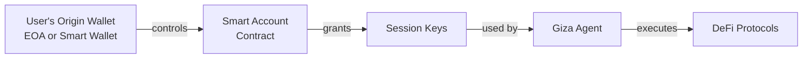
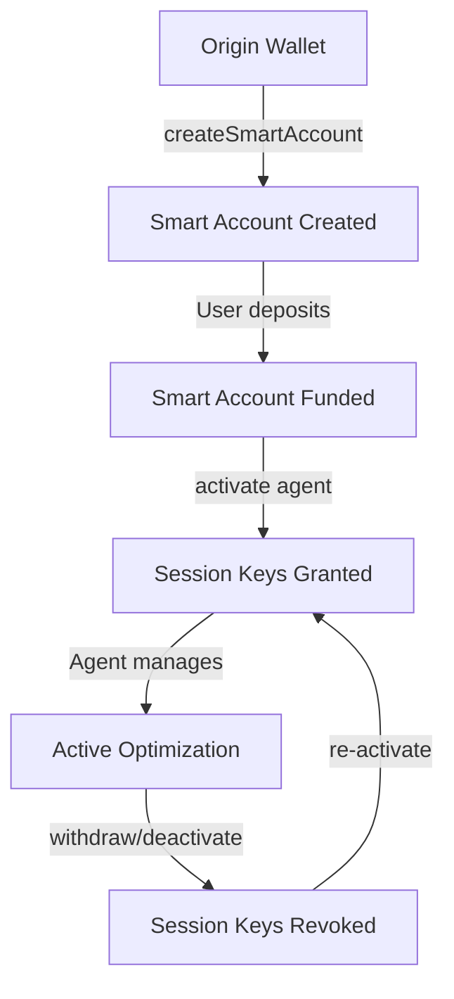
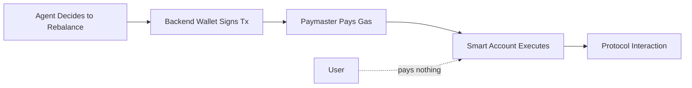

## What are Smart Accounts?

Smart accounts are **smart contract wallets** that enable advanced features like gasless transactions, session keys, and programmable permissions. In Giza, every user gets a smart account that serves as the deposit address for agent-managed funds.

Unlike regular wallets (EOAs - Externally Owned Accounts), smart accounts:
- Are smart contracts, not just private key pairs
- Can execute logic and have programmable rules
- Enable gasless transactions through paymasters
- Support session keys for delegated permissions
- Can batch multiple transactions together

## Architecture

## ZeroDev Integration

Giza smart accounts are powered by **[ZeroDev](https://zerodev.app/)**, a leading account abstraction infrastructure provider.

<AccordionGroup>
  <Accordion title="ERC-4337 Compliant">
    Follows the official Ethereum account abstraction standard for maximum compatibility and security.
  </Accordion>
  
  <Accordion title="Battle-Tested">
    Used by thousands of applications, managing millions in assets.
  </Accordion>
  
  <Accordion title="Gasless Transactions">
    Agents can execute rebalancing without users paying gas for each transaction.
  </Accordion>
  
  <Accordion title="Session Keys">
    Enable secure, time-bound delegated permissions perfect for autonomous agents.
  </Accordion>
</AccordionGroup>

## Deterministic Addresses

Smart accounts are **deterministic** - the same origin wallet always generates the same smart account address.

This means:
- Safe to call `createSmartAccount` multiple times
- Users get the same address across sessions
- No risk of losing funds to a "new" address

<Card title="API Reference" icon="code" href="/sdk-reference/agent/create-smart-account">
  See createSmartAccount() for implementation details
</Card>

## Smart Account Lifecycle

### States

1. **Created**: Smart account exists on-chain but empty
2. **Funded**: User has deposited tokens
3. **Active**: Agent has session key permissions, actively managing
4. **Deactivated**: Permissions revoked, agent no longer managing

## Backend Wallet

The `backendWallet` is a Giza-controlled wallet that:
- Holds session keys to execute transactions
- Acts on behalf of the smart account (with limited permissions)
- Pays gas fees for agent operations
- Is revocable at any time by the user

<Note>
The backend wallet never controls user funds directly.
It only has permission to call specific functions on specific contracts.
</Note>

## Session Keys & Permissions

When an agent is activated, the smart account grants **session keys** to the backend wallet with specific permissions:

### Permission Structure

| Permission Type | Description |
|-----------------|-------------|
| Approved Targets | Specific protocol contracts (Aave, Compound, etc.) |
| Approved Functions | supply, withdraw, transfer |
| Time Limits | Start and end timestamps |
| Transaction Limits | Max amounts per transaction |

### Security Guarantees

<AccordionGroup>
  <Accordion title="Limited Scope">
    Session keys can ONLY:
    - Call approved protocol contracts
    - Execute approved functions (deposit, withdraw, swap)
    - Within approved time windows
    - Up to specified limits
  </Accordion>
  
  <Accordion title="Time-Bound">
    Session keys automatically expire. Agents must request renewal, giving users a regular checkpoint to review and revoke if desired.
  </Accordion>
  
  <Accordion title="Revocable">
    Users can deactivate agents at any time, immediately revoking all session key permissions.
  </Accordion>
  
  <Accordion title="Non-Custodial">
    Users always retain ultimate control via their origin wallet. Giza never has custody of funds.
  </Accordion>
</AccordionGroup>

## Gas Management

One of the key benefits of smart accounts is **gasless transactions** for users:

**How it works:**
1. Agent determines optimal rebalancing is needed
2. Backend wallet crafts and signs the transaction
3. Giza's paymaster sponsors the gas fee
4. Smart account executes the transaction
5. User pays nothing for the rebalancing operation

**Gas costs are:**
- Covered by Giza during active management
- Factored into the performance fee structure
- Optimized through transaction batching

## Troubleshooting

<AccordionGroup>
  <Accordion title="Smart account creation fails">
    Check:
    - Origin wallet is a valid Ethereum address (0x + 40 hex chars)
    - Chain ID is supported
    - API credentials are correct
  </Accordion>
  
  <Accordion title="Can't find existing smart account">
    Make sure:
    - You're using the same `origin_wallet` as when it was created
    - You're querying the correct chain
    - The smart account was actually created (check blockchain explorer)
  </Accordion>
  
  <Accordion title="Deposits not showing up">
    Verify:
    - Transaction was sent to correct `smartAccountAddress`
    - Transaction confirmed on-chain (check explorer)
    - You're checking the right chain
    - Agent was activated after deposit
  </Accordion>
</AccordionGroup>

## Next Steps

<CardGroup cols={2}>
  <Card
    title="Agents"
    icon="robot"
    href="/concepts/agents"
  >
    Learn how agents use smart accounts for optimization
  </Card>
  <Card
    title="API Reference"
    icon="code"
    href="/sdk-reference/agent/create-smart-account"
  >
    See complete smart account API documentation
  </Card>
  <Card
    title="Quickstart"
    icon="rocket"
    href="/quickstart"
  >
    Full integration tutorial
  </Card>
  <Card
    title="Troubleshooting"
    icon="wrench"
    href="/troubleshooting"
  >
    Common issues and solutions
  </Card>
</CardGroup>
