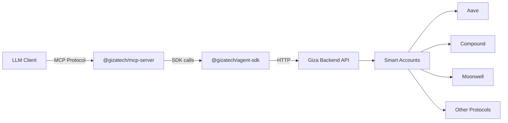

## What is the MCP Server?

`@gizatech/mcp-server` exposes the full Giza Agent SDK as a set of **tools** that any LLM can call through the [Model Context Protocol (MCP)](https://modelcontextprotocol.io/). Instead of writing TypeScript code to interact with the SDK, an LLM like Claude or GPT can call tools directly -- creating smart accounts, activating agents, checking portfolio performance, and running optimizations through natural language.

The server ships as both a **library** (import and customize in your own code) and a **CLI** (run directly via `npx`).

## Architecture



The MCP server sits between the LLM client and the Giza SDK. It:

1. Receives tool calls from the LLM over **stdio** or **HTTP** transport
2. Validates inputs using Zod schemas
3. Delegates to the Giza SDK
4. Returns structured results the LLM can interpret and present to the user

## Supported Clients

The MCP server works with any client that implements the Model Context Protocol:

| Client | Transport | Setup |
|--------|-----------|-------|
| Claude Desktop | stdio | [Quickstart](/mcp-server/quickstart#claude-desktop) |
| Cursor | stdio | [Quickstart](/mcp-server/quickstart#cursor) |
| Claude Code | stdio | [Quickstart](/mcp-server/quickstart#claude-code) |
| Custom backend | HTTP | [Transport](/mcp-server/transport#http) |
| Any MCP client | stdio or HTTP | [Programmatic Usage](/mcp-server/programmatic-usage) |

## How It Works

### Wallet Session Model

The MCP server uses a **connect-then-operate** pattern. Before calling any agent-specific tool (portfolio, lifecycle, financial), the LLM must first connect a wallet address to the session:

```
User: "Check my portfolio for 0x742d...f44e"

LLM calls: connect_wallet({ wallet: "0x742d...f44e" })
LLM calls: get_portfolio()  ← wallet is resolved from session
```

This avoids the LLM having to pass the wallet address on every tool call. The session stores one wallet at a time, and all subsequent tool calls use it automatically.

### Error Handling

All tool errors are caught and converted to LLM-friendly messages. The LLM never sees raw stack traces -- instead it gets actionable text like:

- `"No wallet connected. Use connect_wallet first to set your wallet address for this session."`
- `"Validation error: Invalid Ethereum address"`
- `"Request timed out. Please try again."`

This allows the LLM to communicate failures clearly and recover (e.g., by calling `connect_wallet` when it gets a wallet-not-connected error).

## What's Included

The server registers **23 tools** across 8 groups:

| Group | Tools | Wallet Required |
|-------|-------|:---:|
| [Wallet](/mcp-server/tools#wallet) | `connect_wallet`, `disconnect_wallet` | No |
| [Account](/mcp-server/tools#account) | `create_smart_account`, `get_smart_account` | No |
| [Protocol](/mcp-server/tools#protocol) | `get_protocols`, `get_tokens`, `get_stats`, `get_tvl` | No |
| [Lifecycle](/mcp-server/tools#lifecycle) | `activate_agent`, `deactivate_agent`, `top_up`, `run_agent` | Yes |
| [Portfolio](/mcp-server/tools#portfolio) | `get_portfolio`, `get_performance`, `get_apr`, `get_deposits` | Yes |
| [Financial](/mcp-server/tools#financial) | `withdraw`, `get_withdrawal_status`, `get_transactions`, `get_fees` | Yes |
| [Rewards](/mcp-server/tools#rewards) | `claim_rewards` | Yes |
| [Optimizer](/mcp-server/tools#optimizer) | `optimize`, `simulate` | No |

## Next Steps

<CardGroup cols={2}>
  <Card title="Quickstart" icon="rocket" href="/mcp-server/quickstart">
    Set up the MCP server with Claude Desktop, Cursor, or the CLI
  </Card>
  <Card title="Configuration" icon="gear" href="/mcp-server/configuration">
    Three configuration tiers from zero-config to full control
  </Card>
  <Card title="Tools Reference" icon="wrench" href="/mcp-server/tools">
    Complete reference for all 23 tools
  </Card>
  <Card title="Programmatic Usage" icon="code" href="/mcp-server/programmatic-usage">
    Use as a library: cherry-pick tools, custom prompts, extend with your own tools
  </Card>
</CardGroup>
