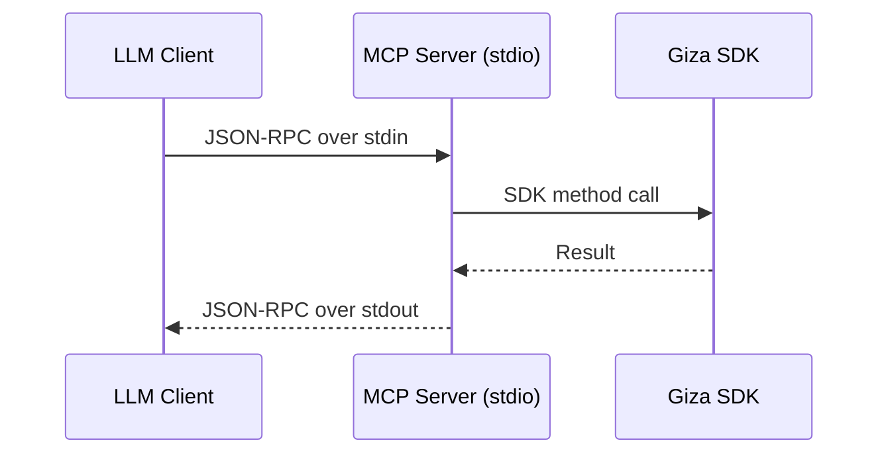
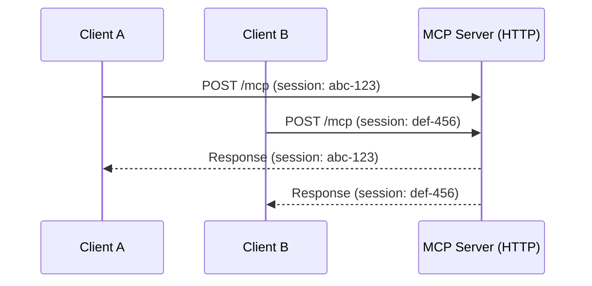

## Overview

The MCP server has two transport modes. The transport determines how MCP messages are sent and received.

## Stdio Transport

**Default transport.** The server reads MCP messages from stdin and writes responses to stdout.

```typescript
import { serve } from '@gizatech/mcp-server';

await serve(); // stdio by default
```

Or explicitly:

```typescript
await serve({ transport: 'stdio' });
```

### When to Use Stdio

- **Claude Desktop, Cursor, Claude Code** -- these clients spawn the server as a child process and communicate over stdin/stdout
- **Local development** -- simple to run and debug
- **Any MCP client** that manages the server process directly

### How It Works



The client starts the server process and communicates via standard I/O pipes. The server runs as long as the client keeps the process alive.

## HTTP Transport

The server starts an HTTP endpoint that accepts MCP messages via `POST /mcp`.

```typescript
import { serve } from '@gizatech/mcp-server';

await serve({ transport: 'http', port: 3000 });
```

Or via environment variables:

```bash
export TRANSPORT=http
export PORT=3000
npx @gizatech/mcp-server
```

### Endpoints

| Method | Path | Description |
|--------|------|-------------|
| `POST` | `/mcp` | MCP message endpoint (StreamableHTTP) |
| `GET` | `/health` | Health check (returns `{"status": "ok"}`) |

### When to Use HTTP

- **Backend services** that connect to the MCP server over the network
- **Multiple clients** connecting to a single server instance
- **Containerized deployments** (Docker, Kubernetes)
- **Custom integrations** where stdio isn't practical

### Session Management

HTTP transport assigns each connection a unique session ID via `crypto.randomUUID()`. This enables multiple clients to connect to the same server instance without interfering with each other.



### Health Check

Use the `/health` endpoint for load balancer or container orchestration health probes:

```bash
curl http://localhost:3000/health
# {"status":"ok"}
```

## Comparison

| Feature | Stdio | HTTP |
|---------|-------|------|
| Setup | Zero config | Requires port |
| Clients | Desktop apps (Claude, Cursor) | Backend services, web apps |
| Concurrency | Single client | Multiple clients |
| Deployment | Local process | Containerizable |
| Network | No network required | Requires network access |
| Session isolation | Single session | UUID per connection |

## Using Transport with the Server Class

When using `GizaServer` directly, call the transport method explicitly:

```typescript
import { GizaServer, resolveConfig } from '@gizatech/mcp-server';

const server = new GizaServer(resolveConfig());

// Stdio
await server.stdio();

// HTTP
await server.http({ port: 3000 });
```

The `serve()` function handles this automatically based on the `transport` config value.
