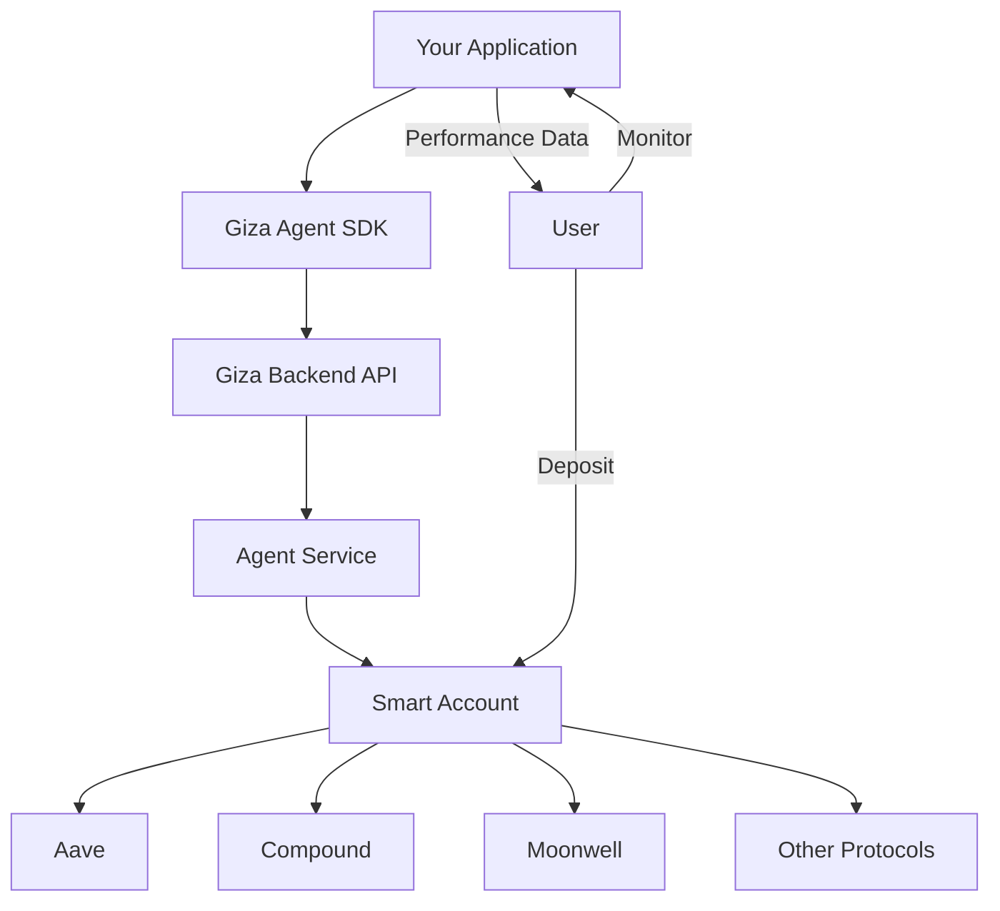

## Overview

This guide will get you up and running with the Giza Agent SDK. You'll create a smart account, activate an agent, and start optimizing yield automatically.

<Note>
This quickstart focuses on the **Agentic integration**. For IaaS (Intelligence as a Service) using the Optimizer only, see the [IaaS Integration Guide](/integration/iaas).
</Note>

## Architecture



## Prerequisites

<AccordionGroup>
  <Accordion title="Node.js 18+">
    Check your version: `node --version`
    
    Download from [nodejs.org](https://nodejs.org/) if needed.
  </Accordion>
  
  <Accordion title="TypeScript Project">
    The SDK is built for TypeScript. JavaScript works too, but you'll miss out on type safety.
  </Accordion>
  
  <Accordion title="Giza API Credentials">
    You'll need:
    - `GIZA_API_KEY` - Your partner API key
    - `GIZA_API_URL` - Giza backend URL
    - `GIZA_PARTNER_NAME` - Your partner identifier
    
    <Card title="Get API Keys" icon="key" href="https://www.gizatech.xyz/">
      Contact Giza to obtain your credentials
    </Card>
  </Accordion>
</AccordionGroup>

## Installation

<CodeGroup>

```bash npm
npm install @gizatech/agent-sdk
```

```bash bun
bun add @gizatech/agent-sdk
```

```bash yarn
yarn add @gizatech/agent-sdk
```

</CodeGroup>

## Environment Setup

Create a `.env` file in your project root:

```bash .env
GIZA_API_KEY=...
GIZA_API_URL=...
GIZA_PARTNER_NAME=...
```

<Warning>
Never commit your `.env` file to version control! Add it to `.gitignore`.
</Warning>

## Complete Integration Flow

### Step 1: Initialize the SDK

```typescript
import { GizaAgent, Chain } from '@gizatech/agent-sdk';

// Initialize once, reuse throughout your app
const giza = new GizaAgent({
  chainId: Chain.BASE,
  timeout: 60000,      // Optional: 60s timeout
  enableRetry: true,   // Optional: retry failed requests
});
```

### Step 2: Create a Smart Account

Generate a smart account for your user. This is where they'll deposit funds.

```typescript
async function onboardUser(userWallet: string) {
  const account = await giza.agent.createSmartAccount({
    origin_wallet: userWallet as `0x${string}`,
  });

  console.log('Smart Account:', account.smartAccountAddress);
  console.log('Deposit funds to this address');
  
  return account;
}
```

<Tip>
The smart account address is **deterministic** - calling `createSmartAccount` with the same `origin_wallet` always returns the same address.
</Tip>

### Step 3: Get Available Protocols

Check which DeFi protocols are available for the token you want to optimize:

```typescript
const USDC_BASE = '0x833589fCD6eDb6E08f4c7C32D4f71b54bdA02913';

const { protocols } = await giza.agent.getProtocols(USDC_BASE);

console.log('Available protocols:', protocols);
// ['aave', 'compound', 'moonwell', 'fluid', ...]
```

### Step 4: User Deposits Funds

<Steps>
  <Step title="User sends tokens to smart account">
    User transfers USDC (or supported token) to the `smartAccountAddress` from Step 2.
  </Step>
  <Step title="Wait for confirmation">
    Wait for the transaction to be confirmed on-chain.
  </Step>
</Steps>

```typescript
// Example: User deposits via your UI
const depositTxHash = await userWallet.sendTransaction({
  to: account.smartAccountAddress,
  value: parseUnits('1000', 6), // 1000 USDC (6 decimals)
});
```

### Step 5: Activate the Agent

After the user deposits, activate the agent to start optimization:

```typescript
const activation = await giza.agent.activate({
  wallet: account.smartAccountAddress,
  origin_wallet: userWallet,
  initial_token: USDC_BASE,
  selected_protocols: ['aave', 'compound', 'moonwell'],
  tx_hash: depositTxHash, // Optional but recommended
  constraints: [
    {
      kind: 'min_protocols',
      params: { min_protocols: 2 } // Always diversify
    }
  ]
});

console.log(activation.message);
```

<Info>
Once activated, the agent automatically:
- Monitors APRs across selected protocols
- Rebalances capital for optimal yield
- Handles all gas costs internally
- Continues optimizing until deactivated
</Info>

### Step 6: Monitor Performance

Track the agent's performance:

```typescript
// Get current portfolio status
const portfolio = await giza.agent.getPortfolio({
  wallet: account.smartAccountAddress,
});

console.log('Status:', portfolio.status);
console.log('Protocols:', portfolio.selected_protocols);

// Get APR
const { apr } = await giza.agent.getAPR({
  wallet: account.smartAccountAddress,
});

console.log(`Current APR: ${apr.toFixed(2)}%`);

// Get performance history
const performance = await giza.agent.getPerformance({
  wallet: account.smartAccountAddress,
});

performance.performance.forEach(point => {
  console.log(`${point.date}: $${point.value_in_usd}`);
});
```

### Step 7: Withdraw Funds

Users can withdraw partially or fully at any time:

<Tabs>
  <Tab title="Full Withdrawal">
    ```typescript
    // Withdraw everything and deactivate agent
    await giza.agent.withdraw({
      wallet: account.smartAccountAddress,
      transfer: true, // Transfer to origin wallet
    });

    // Poll for completion
    const finalStatus = await giza.agent.pollWithdrawalStatus(
      account.smartAccountAddress,
      {
        interval: 5000,
        timeout: 300000,
        onUpdate: (status) => console.log('Status:', status),
      }
    );

    console.log('Withdrawal complete:', finalStatus.status);
    ```
  </Tab>
  
  <Tab title="Partial Withdrawal">
    ```typescript
    // Withdraw specific amount, agent stays active
    const withdrawal = await giza.agent.withdraw({
      wallet: account.smartAccountAddress,
      amount: '500000000', // 500 USDC (6 decimals)
    });

    console.log('Withdrawn:', withdrawal.total_value);
    // Agent continues optimizing remaining balance
    ```
  </Tab>
</Tabs>

## Additional Operations

### Top-Up Active Agent

```typescript
await giza.agent.topUp({
  wallet: smartAccountAddress,
  tx_hash: newDepositTxHash,
});
```

### Update Protocols

```typescript
await giza.agent.updateProtocols(
  smartAccountAddress,
  ['aave', 'compound', 'moonwell', 'fluid']
);
```

### Manual Rebalance

```typescript
const result = await giza.agent.run({
  wallet: smartAccountAddress
});
```

## Error Handling

Always wrap SDK calls in try-catch blocks:

```typescript
import { ValidationError, GizaAPIError, TimeoutError } from '@gizatech/agent-sdk';

try {
  const account = await giza.agent.createSmartAccount({
    origin_wallet: userWallet,
  });
} catch (error) {
  if (error instanceof ValidationError) {
    console.error('Invalid input:', error.message);
  } else if (error instanceof GizaAPIError) {
    console.error('API error:', error.statusCode, error.message);
  } else if (error instanceof TimeoutError) {
    console.error('Request timed out');
  }
}
```

<Card title="Error Handling Guide" icon="shield-exclamation" href="/guides/error-handling">
  Learn about error types and handling strategies
</Card>

## Troubleshooting

<AccordionGroup>
  <Accordion title="Environment variables not found">
    Make sure:
    - `.env` file exists in project root
    - You're loading it (e.g., `dotenv` package)
    - Variable names match exactly: `GIZA_API_KEY`, `GIZA_API_URL`, `GIZA_PARTNER_NAME`
  </Accordion>
  
  <Accordion title="ValidationError: invalid address">
    Addresses must:
    - Start with `0x`
    - Be 42 characters long (0x + 40 hex chars)
    - Use valid hex characters (0-9, a-f, A-F)
  </Accordion>
  
  <Accordion title="API returns 401 Unauthorized">
    Check:
    - API key is correct and active
    - Partner name matches your registration
    - API URL is correct
  </Accordion>
  
  <Accordion title="Agent activation fails">
    Ensure:
    - Smart account has received the deposit
    - Transaction hash is valid and confirmed
    - Selected protocols are available for the token
    - Token address is correct for the chain
  </Accordion>
</AccordionGroup>

<Card title="Full Troubleshooting Guide" icon="wrench" href="/troubleshooting">
  See common issues and solutions
</Card>

## Next Steps

<CardGroup cols={2}>
  <Card
    title="Core Concepts"
    icon="book"
    href="/concepts/overview"
  >
    Understand smart accounts, agents, and protocols
  </Card>
  <Card
    title="SDK Reference"
    icon="code"
    href="/sdk-reference/overview"
  >
    Explore all SDK methods
  </Card>
  <Card
    title="API Reference"
    icon="server"
    href="/api-reference/introduction"
  >
    HTTP API documentation
  </Card>
  <Card
    title="Advanced Patterns"
    icon="lightbulb"
    href="/examples/advanced-patterns"
  >
    Multi-chain, constraints, and more
  </Card>
  <Card
    title="IaaS Integration"
    icon="brain"
    href="/guides/iaas-integration"
  >
    Use Optimizer with your own infrastructure
  </Card>
</CardGroup>
