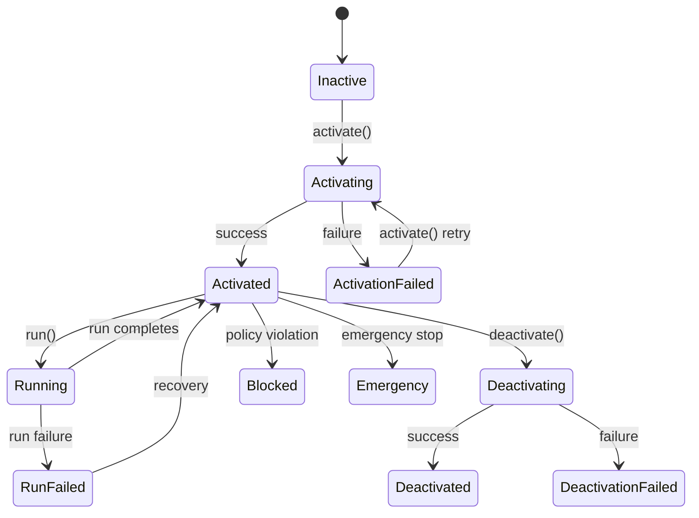

## Overview

Lifecycle methods manage the agent's operational state. An agent transitions through several states from creation to deactivation. All methods in this section are called on an [`Agent`](/sdk-reference/agent/overview) instance.

## State Diagram

The agent follows this state machine during its lifecycle:



The `AgentStatus` enum maps to these states:

```typescript
enum AgentStatus {
  UNKNOWN = 'unknown',
  ACTIVATING = 'activating',
  ACTIVATION_FAILED = 'activation_failed',
  ACTIVATED = 'activated',
  RUNNING = 'running',
  RUN_FAILED = 'run_failed',
  BLOCKED = 'blocked',
  DEACTIVATING = 'deactivating',
  DEACTIVATION_FAILED = 'deactivation_failed',
  DEACTIVATED = 'deactivated',
  EMERGENCY = 'emergency',
  DEACTIVATED_FEE_NOT_PAID = 'deactivated_fee_not_paid',
  BRIDGING = 'bridging',
}
```

## `activate(options)`

```typescript
async activate(options: ActivateOptions): Promise<ActivateResponse>
```

Activates the agent by registering the initial deposit, token, and protocol selection. Call this after the user has sent their deposit transaction.

### Parameters

<ParamField path="owner" type="Address" required>
  The EOA address that owns the smart account.
</ParamField>

<ParamField path="token" type="Address" required>
  The deposit token address (e.g., USDC).
</ParamField>

<ParamField path="protocols" type="string[]" required>
  List of protocol names the agent should allocate to. Must contain at least one protocol.
</ParamField>

<ParamField path="txHash" type="string" required>
  The transaction hash of the user's deposit into the smart account.
</ParamField>

<ParamField path="constraints" type="ConstraintConfig[]">
  Optional allocation constraints (min/max amounts per protocol, excluded protocols).
</ParamField>

### Return Type

```typescript
interface ActivateResponse {
  message: string;
  wallet: string;
}
```

### Example

```typescript
import { Giza, Chain } from '@gizatech/agent-sdk';

const giza = new Giza({ chain: Chain.BASE });
const agent = await giza.createAgent('0xUserEOA...');

const result = await agent.activate({
  owner: '0xUserEOA...',
  token: '0x833589fCD6eDb6E08f4c7C32D4f71b54bdA02913', // USDC on Base
  protocols: ['aave', 'compound', 'moonwell'],
  txHash: '0xDepositTransactionHash...',
});

console.log(result.message);  // 'Agent activated successfully'
console.log(result.wallet);   // smart account address
```

### Activation with Constraints

```typescript
await agent.activate({
  owner: '0xUserEOA...',
  token: '0x833589fCD6eDb6E08f4c7C32D4f71b54bdA02913',
  protocols: ['aave', 'compound', 'moonwell'],
  txHash: '0xDepositTxHash...',
  constraints: [
    {
      kind: 'max_allocation_amount_per_protocol',
      params: { protocol: 'aave', amount: '500000000' },
    },
    {
      kind: 'exclude_protocol',
      params: { protocol: 'euler' },
    },
  ],
});
```

---

## `deactivate(options?)`

```typescript
async deactivate(options?: DeactivateOptions): Promise<DeactivateResponse>
```

Deactivates the agent and optionally transfers remaining funds back to the owner. The agent withdraws from all protocols before deactivating.

### Parameters

<ParamField path="transfer" type="boolean">
  Whether to transfer funds back to the owner's EOA. Defaults to `true`.
</ParamField>

### Return Type

```typescript
interface DeactivateResponse {
  message: string;
}
```

### Example

```typescript
// Deactivate and transfer funds back (default)
const result = await agent.deactivate();
console.log(result.message);

// Deactivate but keep funds in the smart account
const result2 = await agent.deactivate({ transfer: false });
```

<Warning>
Deactivation is asynchronous. The agent enters the `DEACTIVATING` state and may take time to withdraw from all protocols. Use `agent.waitForDeactivation()` to poll until the process completes.
</Warning>

---

## `topUp(txHash)`

```typescript
async topUp(txHash: string): Promise<TopUpResponse>
```

Records an additional deposit into an already-active agent. Call this after the user sends a follow-up deposit transaction to the smart account.

### Parameters

<ParamField path="txHash" type="string" required>
  The transaction hash of the additional deposit.
</ParamField>

### Return Type

```typescript
interface TopUpResponse {
  message: string;
}
```

### Example

```typescript
const result = await agent.topUp('0xAdditionalDepositTxHash...');
console.log(result.message);
```

<Note>
The agent must be in the `ACTIVATED` state to accept a top-up. If the agent is deactivating or deactivated, the call will fail.
</Note>

---

## `run()`

```typescript
async run(): Promise<RunResponse>
```

Triggers a manual optimization run. The agent evaluates current protocol yields and rebalances allocations if a better distribution is found.

### Return Type

```typescript
interface RunResponse {
  status: string;
}
```

### Example

```typescript
const result = await agent.run();
console.log('Run status:', result.status);
```

<Info>
Agents also run automatically on a schedule. Use `run()` when you want to trigger an immediate rebalancing, for example after market conditions change.
</Info>

## Complete Lifecycle Example

```typescript
import { Giza, Chain } from '@gizatech/agent-sdk';

const giza = new Giza({ chain: Chain.BASE });
const USDC = '0x833589fCD6eDb6E08f4c7C32D4f71b54bdA02913';

// 1. Create agent
const agent = await giza.createAgent('0xUserEOA...');

// 2. Activate after user deposits
await agent.activate({
  owner: '0xUserEOA...',
  token: USDC,
  protocols: ['aave', 'compound'],
  txHash: '0xInitialDepositTx...',
});

// 3. Top up with additional deposit
await agent.topUp('0xSecondDepositTx...');

// 4. Trigger a manual run
await agent.run();

// 5. Monitor status
const info = await agent.portfolio();
console.log('Status:', info.status);

// 6. Deactivate when done
await agent.deactivate();

// 7. Wait for deactivation to complete
const final = await agent.waitForDeactivation({
  interval: 10000,  // poll every 10 seconds
  timeout: 300000,  // give up after 5 minutes
  onUpdate: (status) => console.log('Status:', status),
});
console.log('Final status:', final.status);
```

## Next Steps

<CardGroup cols={2}>
  <Card title="Monitoring" icon="chart-line" href="/sdk-reference/agent/monitoring">
    Track portfolio value, APR, and performance history
  </Card>
  <Card title="Agent Overview" icon="robot" href="/sdk-reference/agent/overview">
    All Agent methods at a glance
  </Card>
</CardGroup>
